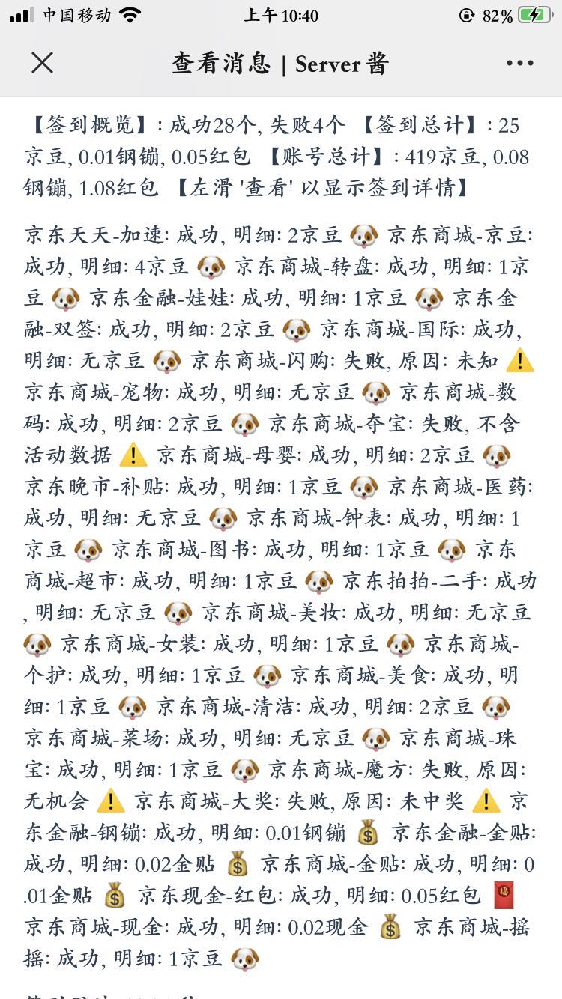

# 基于github action的京东自动化签到

## 介绍

> 使用NobyDa “京东多合一签到脚本”为基础，移植到github actions自动化执行。

## 触发方式
* 点亮`Star`
* 凌晨4点定时执行
*  自定义：.github/workflows/work.yaml 编辑

## 使用用法
* 点击右上角 `Fork` 项目；
* `Settings` -> `Secrets` 中添加京东cookie、钉钉群机器人的token
	- `JD_COOKIE`：京东cookie,多账号使用英文`|`进行分隔，例如 `a|b`
	- `PUSH_KEY`：钉钉群组机器人自定义webhook的token
* 点击`Star`，任务会自动执行，运行进度和结果可以在`Actions`页面查看；
* 当任务运行完成时，会将运行结果和错误信息打包到`Artifacts`，可自行下载查看；

## 获取京东cookie

* 使用项目中的Chrome插件：`JDCookie`
* Chrome中拓展程序开启`开发者模式`；
* 点击`加载已解压的拓展程序`，选择`JDCookie`目录；
* 登录[领京豆](https://bean.m.jd.com/)；
* 点击`JDCookie`即可拷贝京东cookie

## 获取钉钉群组机器人token

* 注册并登陆钉钉，建立群组（3人以上，建立后，其他人可以退出，群组不解散）
* 右上角-群设置-智能群助手-添加群助手-添加机器人-自定义-添加-只勾选关键词验证，关键词填 `京东`-同意并添加助手-完成-复制出webhook地址
* `https://oapi.dingtalk.com/robot/send?access_token=xxxxxxxxxxxxx` 只保留 `access_token=`后的部分`xxxxxxxxxxxxx`，

## 效果截图

## 参考项目
* [NobyDa/Script/JD-DailyBonus](https://github.com/NobyDa/Script/blob/master/JD-DailyBonus/JD_DailyBonus.js)
* [ruicky/jd-sign-bot](https://github.com/ruicky/jd_sign_bot)
* [jerrykuku/luci-app-jd-dailybonus](https://github.com/jerrykuku/luci-app-jd-dailybonus)
